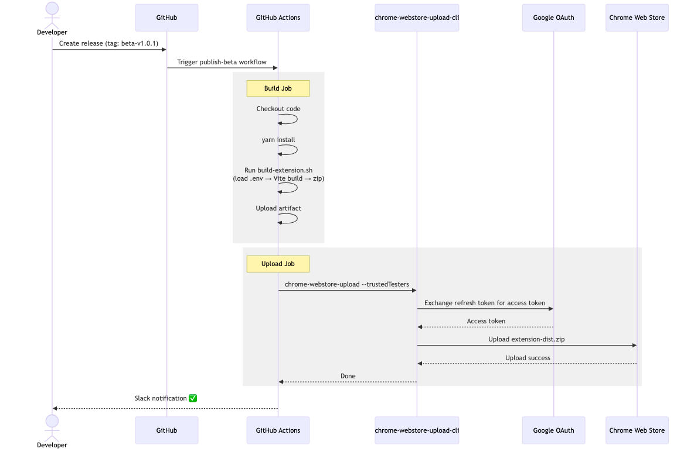
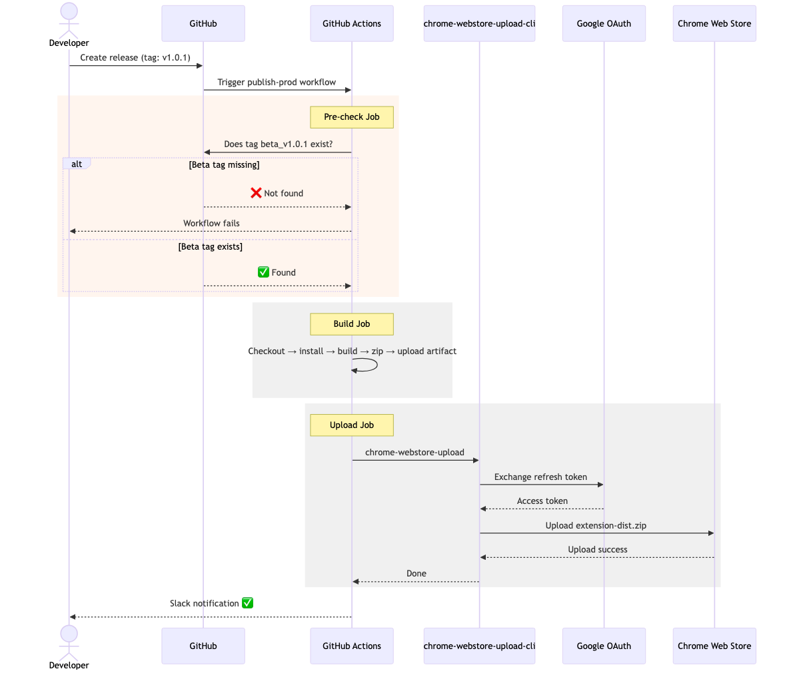

# Chrome Extension — Automated Deployment

Automated CI/CD pipeline for publishing a Chrome extension to the Chrome Web Store via GitHub Actions.

## How to Deploy

### Beta (trusted testers)

1. Go to **Releases** → **Draft a new release**
2. Create a new tag: `beta-v1.0.1`
3. Publish the release — workflow builds, uploads to CWS with trusted testers visibility, and notifies Slack

### Production

1. Go to **Releases** → **Draft a new release**
2. Create a new tag: `v1.0.1`
3. Publish the release — workflow verifies a matching beta tag exists, builds, uploads to CWS publicly, and notifies Slack

> **Safety gate:** Prod deployment is blocked unless a matching beta release (`beta_v1.0.1`) already exists.

## Workflow Sequence Diagrams

### Beta Workflow

### Production Workflow

## GitHub Secrets Required

| Secret | Purpose |
|--------|---------|
| `CHROME_EXTENSION_ID_PROD` / `_BETA` | Extension IDs |
| `CI_GOOGLE_CLIENT_ID` | OAuth client ID |
| `CI_GOOGLE_CLIENT_SECRET` | OAuth client secret |
| `CI_GOOGLE_REFRESH_TOKEN` | OAuth refresh token for CWS API |
| `SLACK_WEBHOOK_URL` | Slack notifications |
